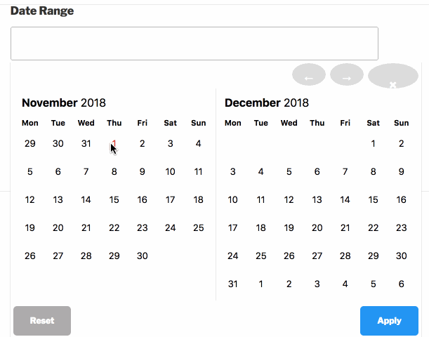

# Date Range for Ninja Forms
**Contributors:** PerS
**Donate link:** https://soderlind.no/donate/
**Tags:** date
**Requires at least:** 4.9.8
**Tested up to:** 4.9.8
**Stable tag:** 0.0.1
Requires PHP: 7.0
**License:** GPLv2 or later
**License URI:** https://www.gnu.org/licenses/gpl-2.0.html

Add a Date Range field to Ninja Forms.

## Description

TBA

## Installation

1. Upload the plugin files to the `/wp-content/plugins/data-range-ninja-forms` directory, or install the plugin through the WordPress plugins screen directly.
1. Activate the plugin through the 'Plugins' screen in WordPress
1. Use Ninja Forms to add the Date Range field.

## Screenshots

### 1. Using Ninja Forms to add the Date Range field.
[missing image]

### 2. Date Range at the front-end.

## Changelog

### 0.0.2

* Set date format in Ninja Form builder

### 0.0.1

* Initial release.

