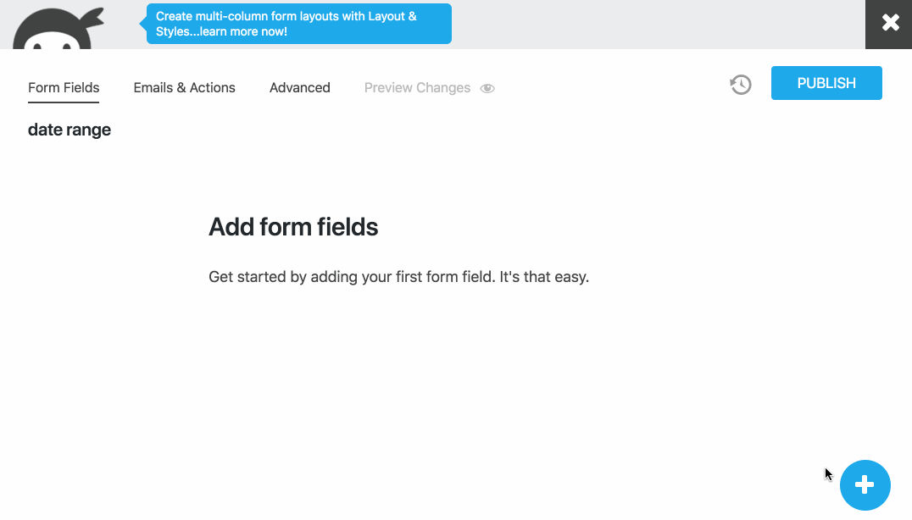

# Date Range field for Ninja Forms
&nbsp; | &nbsp;
------------ | -------------
**Contributors:** | PerS
**Donate link:** | https://soderlind.no/donate/
**Tags:** | date
**Requires at least:** | 4.9.8
**Tested up to:** | 5.4
**Stable tag:** | 0.0.4
Requires PHP: | 7.2
**License:** | GPLv2 or later
**License URI:** | https://www.gnu.org/licenses/gpl-2.0.html

Add a Date Range field to Ninja Forms.

## Description

Add a Date Range field to your Ninja Forms.

## Installation

1. Upload the plugin files to the `/wp-content/plugins/data-range-ninja-forms` directory, or install the plugin through the WordPress plugins screen directly.
1. Activate the plugin through the 'Plugins' screen in WordPress
1. Use Ninja Forms to add the Date Range field.

## Screenshots

### 1. Using Ninja Forms to add the Date Range field.

### 2. Date Range at the front-end.

## Changelog

### 0.0.4

* Replace Lightpick, no longer maintained, with [Litepicker](https://github.com/wakirin/Litepicker)

### 0.0.3

* In Ninja Forms builder, select WP Settings date.

### 0.0.2

* Set date format in Ninja Form builder

### 0.0.1

* Initial release.

## Credits

Date Range field for Ninja Forms uses [Litepicker](https://github.com/wakirin/Litepicker). The Litepicker has a MIT licence and is Copyright 2019 [Rinat G](https://github.com/wakirin/).

## Copyright and License

Date Range field for Ninja Forms is copyright 2020 Per Soderlind

Date Range field for Ninja Forms is free software: you can redistribute it and/or modify it under the terms of the GNU General Public License as published by the Free Software Foundation, either version 2 of the License, or (at your option) any later version.

Date Range field for Ninja Forms is distributed in the hope that it will be useful, but WITHOUT ANY WARRANTY; without even the implied warranty of MERCHANTABILITY or FITNESS FOR A PARTICULAR PURPOSE. See the GNU General Public License for more details.

You should have received a copy of the GNU Lesser General Public License along with the Extension. If not, see http://www.gnu.org/licenses/.
