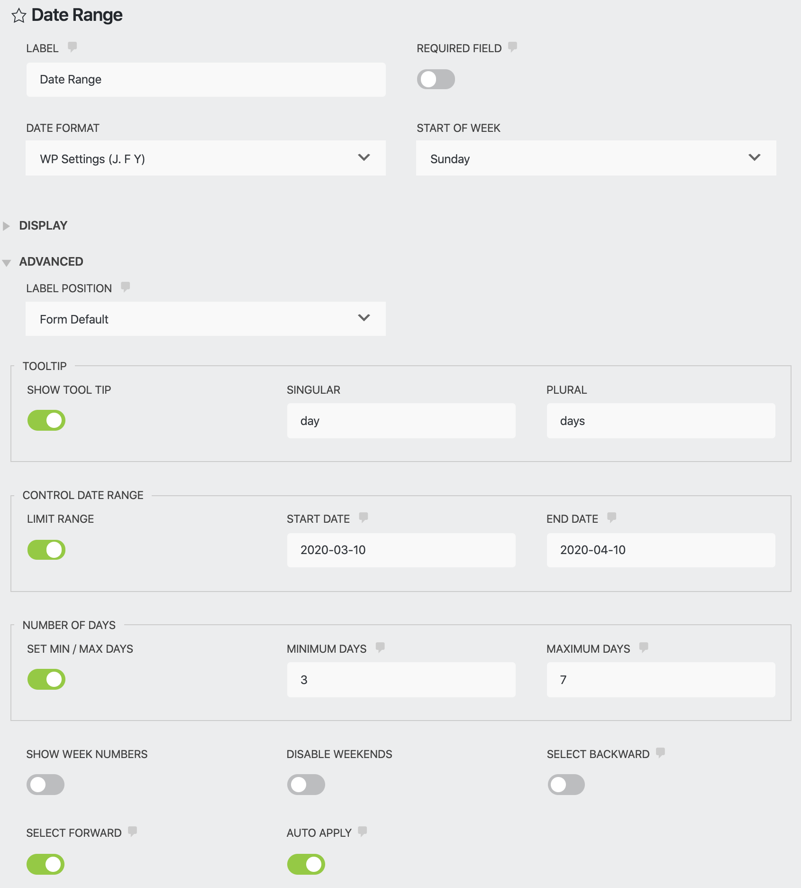
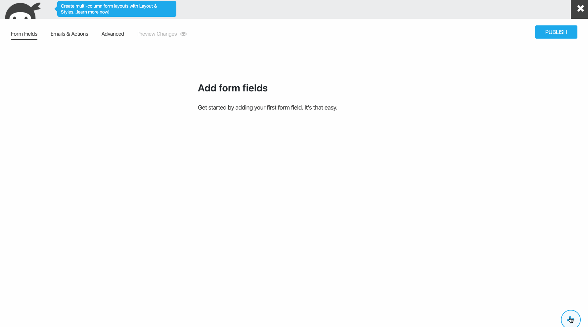
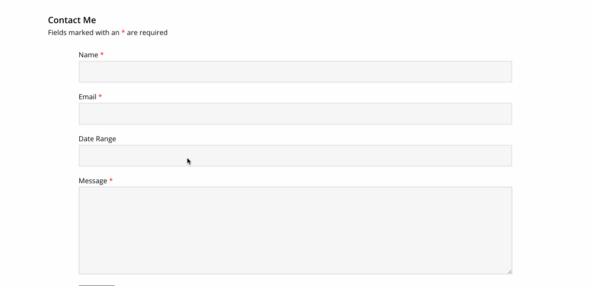

# Date Range field for Ninja Forms

[](//packagist.org/packages/soderlind/date-range-ninja-forms)


[Description](#description) | [Installation](#installation) | [Screenshots](#screenshots) | [Filters](#filters) | [Changelog](#changelog) | [Credits](#credits) | [Copyright and License](#copyright-and-license)


## Description

Add a Date Range field to your Ninja Forms.


## Installation

1. Upload the plugin files to the `/wp-content/plugins/data-range-ninja-forms` directory, or install the plugin through the WordPress plugins screen directly.
1. Activate the plugin through the 'Plugins' screen in WordPress
1. Use Ninja Forms to add the Date Range field.


## Screenshots

### 1. Settings


### 2. Using Ninja Forms to add the Date Range field.


### 3. Date Range at the front-end.


## Filters

Add the filters to your child theme functions.php

### `date_range_lang`

Override the value returned from get_locale().

E.g. if using Polylang, add:

```php
add_filter( 'date_range_lang', function( $locale ) {
	if ( function_exists( 'pll_current_language' ) ) {
		$locale = pll_current_language( 'locale' );
	}
	return $locale;
} );
```

### `date_range_dropdowns`

Enable dropdowns for months, years.

If `maxYear` is `null` then `maxYear` will be equal to `(new Date()).getFullYear()`.

```php
add_filter( 'date_range_dropdowns', function( $dropdowns ) {

	$dropdowns = [
		'minYear' => 2020,
		'maxYear' => 2030,
		'months'  => false,
		'years'   => true, // show dropdown for years.
	];

	return $dropdowns;
} );
```

### `date_range_buttontext`

Text for buttons.

```php
add_filter( 'date_range_buttontext', function( $buttontext ) {

	$buttontext = [
		'apply'         => 'Apply',
		'cancel'        => 'Cancel',
		'previousMonth' => '<svg .../></svg>',
		'nextMonth'     => '<svg .../></svg>',
	];

	return $buttontext;
} );
```

## See also

I've created an [iCalendar](https://github.com/soderlind/icalendar-ninja-form) add-on for Ninja Forms.

## Changelog

### 1.0.2

* Lint source code using PHP CodeSniffer and [Rome](https://rome.tools/).

### 1.0.1

* Add date setting field

### 1.0.0

* Refactor

### 0.1.0

* [Custom validation](https://github.com/soderlind/date-range-ninja-forms/blob/master/js/date-range.js#L29-L106) for required fields
* Add moment.js
* Refactor code, using ES2019 Class Fields.

### 0.0.7

* Refactor JavaScript to ES6.

### 0.0.6

* Fix breaking bug

### 0.0.5

* Add more settings.
* Add [filters](#filters): `date_range_lang`, `date_range_dropdowns` and `date_range_buttontext`.
* Add `languages/date-range-ninja-forms.pot`


### 0.0.4

* Replace Lightpick, no longer maintained, with [Litepicker](https://github.com/wakirin/Litepicker)


### 0.0.3

* In Ninja Forms builder, select WP Settings date.

### 0.0.2

* Set date format in Ninja Form builder

### 0.0.1

* Initial release.


## Credits

Date Range field for Ninja Forms uses [Litepicker](https://github.com/wakirin/Litepicker). The Litepicker has a MIT licence and is Copyright 2019 [Rinat G](https://github.com/wakirin/).

## Copyright and License

Date Range field for Ninja Forms is copyright 2020 Per Soderlind

Date Range field for Ninja Forms is free software: you can redistribute it and/or modify it under the terms of the GNU General Public License as published by the Free Software Foundation, either version 2 of the License, or (at your option) any later version.

Date Range field for Ninja Forms is distributed in the hope that it will be useful, but WITHOUT ANY WARRANTY; without even the implied warranty of MERCHANTABILITY or FITNESS FOR A PARTICULAR PURPOSE. See the GNU General Public License for more details.

You should have received a copy of the GNU Lesser General Public License along with the Extension. If not, see http://www.gnu.org/licenses/.
